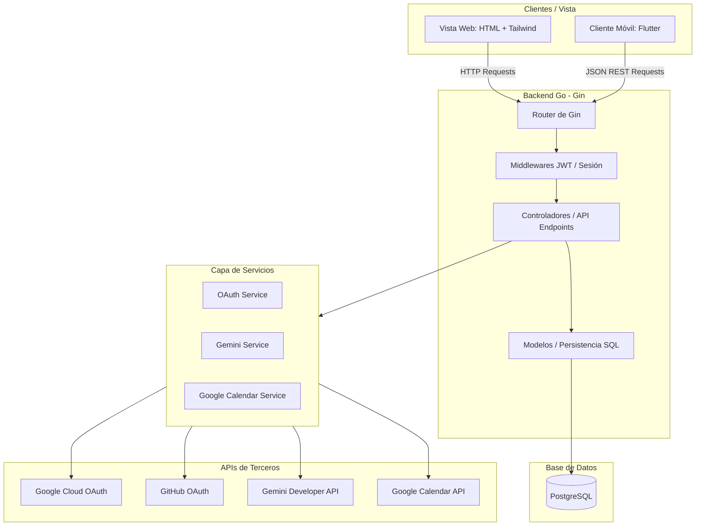

# 📅 Event Hub (Cliente Móvil Flutter)

[](https://flutter.dev/)
[](https://dart.dev/)
[](https://pub.dev/packages/flutter_bloc)
[](https://pub.dev/packages/dio)
[](https://deepmind.google/technologies/gemini/)

Event Hub es un ecosistema de software diseñado bajo un patrón arquitectónico híbrido que unifica una plataforma web nativa y una aplicación móvil multiplataforma. Permite gestionar, buscar y sincronizar eventos de manera inteligente a través de la integración de inteligencia artificial y servicios en la nube.

Este repositorio contiene la **aplicación móvil (Cliente Móvil)** desarrollada en **Flutter/Dart**, la cual se conecta a la API REST de Event Hub para ofrecer una experiencia fluida, moderna y optimizada en dispositivos móviles iOS y Android.

---

## 📖 Índice
- [1. Información General del Sistema](#1-información-general-del-sistema)
- [2. Pilares del Alcance Técnico (Enfoque Móvil)](#2-pilares-del-alcance-técnico-enfoque-móvil)
- [3. Arquitectura Modular del Cliente](#3-arquitectura-modular-del-cliente)
- [4. Estructura del Proyecto](#4-estructura-del-proyecto)
- [5. Gestión del Estado y Seguridad](#5-gestión-del-estado-y-seguridad)
- [6. Matriz de Componentes Tecnológicos](#6-matriz-de-componentes-tecnológicos)
- [7. Plan de Desarrollo por Fases](#7-plan-de-desarrollo-por-fases)
- [8. Guía de Instalación y Configuración](#8-guía-de-instalación-y-configuración)
- [9. Ejecución de Pruebas](#9-ejecución-de-pruebas)
- [10. Gestión de Issues (GitHub)](#10-gestión-de-issues-github)
- [11. Buenas Prácticas y Código Limpio](#11-buenas-prácticas-y-código-limpio)
- [12. Créditos](#12-créditos)

---

## 1. Información General del Sistema
- **Nombre del Software:** Event Hub (Cliente Móvil)
- **Enfoque Arquitectónico (Móvil):** Clean Architecture / BLoC Pattern con desacoplamiento en capas de Data, Domain y Presentation (Screens & BLoCs).
- **Stack Tecnológico Principal:** Dart (Flutter Framework) & BLoC para la gestión del estado.
- **Conectividad:** Consumo de la API REST del backend de Go mediante peticiones JSON seguras.
- **Diseñadores Principales:** Sebastian Piñango, Edgar Gutiérrez

---

## 2. Pilares del Alcance Técnico (Enfoque Móvil)

### A. Autenticación Delegada e Integración JWT
Inicio de sesión optimizado delegando la identidad al backend (OAuth 2.0 con Google y GitHub). Una vez autenticado, el cliente móvil recibe de forma segura el token JWT del backend y lo almacena de manera persistente utilizando cifrado en el dispositivo.

### B. Generación de Contenido por IA (Gemini API Integration)
Formulario de creación de eventos móvil integrado con el asistente inteligente. Al ingresar el título y ubicación de un evento, el cliente móvil solicita al backend (vía API REST) la generación de la descripción utilizando el modelo **gemini-2.5-flash**, autocompletando el campo de descripción de forma instantánea y profesional en la pantalla del dispositivo.

### C. Dashboard de Búsqueda y Filtrado Reactivo
Cartelera móvil responsiva con barra de búsqueda e interactividad en tiempo real. Filtros dinámicos por categorías que disparan eventos de búsqueda enviando solicitudes optimizadas a los endpoints indexados del backend, garantizando un renderizado rápido y fluido.

### D. Inscripción y Sincronización
Los usuarios se inscriben a eventos directamente desde la app móvil. Esta acción se procesa de forma transaccional en el backend para reducir el cupo disponible y actualizar asíncronamente a los asistentes (`attendees`) del evento en Google Calendar.

### E. Interfaz y Experiencia de Usuario Premium
Diseño visual pulido y moderno de componentes interactivos con microanimaciones, retroalimentación táctil y transiciones suaves de navegación para mejorar la retención de usuarios.

---

## 3. Arquitectura Modular del Cliente



La arquitectura del cliente móvil está dividida en tres capas principales:
- **Presentation Layer (Presentación):** Compuesta por pantallas reactivas (Screens) y BLoCs (`auth_bloc`, `dashboard_bloc`, `event_bloc`). La UI reacciona directamente al flujo unidireccional de estados emitidos.
- **Domain Layer (Dominio):** Define las entidades del negocio y las interfaces (contratos) de los repositorios para garantizar que la lógica de presentación no dependa directamente de la infraestructura de datos.
- **Data Layer (Datos):** Implementa las interfaces de los repositorios. Se encarga del parseo de respuestas JSON (`json_serializable`), persistencia segura local (`flutter_secure_storage`) y peticiones de red centralizadas con la librería `Dio`.

---

## 4. Estructura del Proyecto

```text
eventhubapp/
├── android/                  # Configuración nativa y Gradle para Android
├── ios/                      # Configuración nativa y Podfile para iOS
├── lib/
│   ├── core/                 # Componentes transversales del sistema
│   │   ├── network/
│   │   │   └── api_client.dart# Cliente Dio centralizado con interceptores y base URL
│   │   ├── theme/
│   │   │   └── app_theme.dart # Diseño visual (paletas de colores, fuentes, glassmorphism)
│   │   └── utils/
│   │       ├── constants.dart # Constantes de endpoints y llaves
│   │       └── validators.dart# Validaciones de formularios de entrada
│   ├── features/             # Módulos del negocio (Arquitectura por Features)
│   │   ├── auth/             # Módulo de Autenticación (Login, Registro, JWT)
│   │   │   ├── data/
│   │   │   │   └── repositories/auth_repository_impl.dart
│   │   │   ├── domain/
│   │   │   │   └── repositories/auth_repository.dart
│   │   │   └── presentation/
│   │   │       ├── bloc/     # Manejo de estados de autenticación (BLoC)
│   │   │       │   ├── auth_bloc.dart
│   │   │       │   ├── auth_event.dart
│   │   │       │   └── auth_state.dart
│   │   │       └── screens/  # Pantallas de Login y Registro
│   │   │           ├── login_screen.dart
│   │   │           └── register_screen.dart
│   │   ├── dashboard/        # Cartelera de Eventos y Filtros
│   │   │   ├── data/
│   │   │   │   └── models/category_model.dart
│   │   │   └── presentation/
│   │   │       ├── bloc/     # Manejo de estados de cartelera (BLoC)
│   │   │       │   ├── dashboard_bloc.dart
│   │   │       │   ├── dashboard_event.dart
│   │   │       │   └── dashboard_state.dart
│   │   │       └── screens/  # Vista principal de la cartelera
│   │   │           └── dashboard_screen.dart
│   │   └── events/           # Módulo de Eventos (Creación e Inscripción)
│   │       ├── data/
│   │       │   └── models/event_model.dart
│   │       └── presentation/
│   │           ├── bloc/     # Manejo de estados de creación y detalle (BLoC)
│   │           │   ├── event_bloc.dart
│   │           │   ├── event_event.dart
│   │           │   └── event_state.dart
│   │           └── screens/  # Detalle del evento y Creación (botón Gemini)
│   │               ├── create_event_screen.dart
│   │               └── event_detail_screen.dart
│   ├── main.dart             # Punto de entrada de la aplicación Flutter
│   └── router/               # Rutas de navegación de la app
├── test/                     # Directorio de pruebas unitarias y de widgets
├── .env                      # Variables de entorno locales
├── pubspec.yaml              # Declaración de dependencias del proyecto y assets
└── pubspec.lock              # Checksum y bloqueo de versiones de dependencias
```

---

## 5. Gestión del Estado y Seguridad

### A. Estado Predecible con BLoC
El flujo de datos del cliente móvil está controlado estrictamente por la arquitectura BLoC (Business Logic Component). Las pantallas emiten eventos (`Events`) hacia el BLoC y este, tras procesar los datos a través del repositorio, emite estados (`States`) que reconstruyen la UI reactivamente con widgets `BlocBuilder` y `BlocConsumer`.

### B. Persistencia Segura de Credenciales
Para mitigar riesgos de seguridad, el token JWT obtenido tras la autenticación nunca se almacena en texto plano o en almacenamiento desprotegido. Se utiliza la librería `flutter_secure_storage` que encapsula:
- **Keychain** en dispositivos iOS.
- **Keystore** con cifrado AES en dispositivos Android.

### C. Cliente de Red (Dio Client)
La clase `ApiClient` centraliza el consumo HTTP con `Dio`. Utiliza un sistema de interceptores para inyectar de manera transparente el header `Authorization: Bearer <token>` cuando el token esté presente, y captura de forma unificada errores de red u códigos HTTP (ej. redirección ante expiración del token).

---

## 6. Matriz de Componentes Tecnológicos

| Componente Técnico | Capa del Sistema | Función y Comportamiento |
| :--- | :--- | :--- |
| **Flutter SDK (Dart)** | UI / Framework | Plataforma de compilación nativa multiplataforma (Android & iOS). |
| **flutter_bloc** | Presentación / Estado | Gestión del estado predecible y separación limpia de la UI de la lógica de negocio. |
| **Dio Client** | Capa de Datos / Red | Conexión HTTP robusta con interceptores, timeouts y serialización estructurada. |
| **flutter_secure_storage** | Capa de Datos / Seguridad | Encriptación y almacenamiento persistente local de credenciales (JWT). |
| **flutter_dotenv** | Configuración / Core | Carga y mapeo de variables de configuración locales (ej. URL del backend). |
| **intl** | Utilidades / Core | Formateo dinámico y localización de fechas, horas y textos informativos del sistema. |

---

## 7. Plan de Desarrollo por Fases

### Fase 1: Estructuración y Configuración Inicial
- Inicialización del proyecto Flutter, configuración de plugins nativos (Android/iOS) y descarga de dependencias (`flutter_bloc`, `dio`, `flutter_secure_storage`).
- Configuración de temas visuales dinámicos (`app_theme.dart`) y variables de entorno (`.env`).

### Fase 2: Módulo de Autenticación y Persistencia JWT
- Construcción de los formularios de login y registro.
- Implementación de `auth_repository.dart` para consumir la API de autenticación y de `auth_bloc.dart` para gestionar el estado de la sesión.
- Implementación del almacenamiento seguro del JWT.

### Fase 3: Cartelera Principal y Búsqueda Reactiva (Dashboard)
- Creación de la pantalla `dashboard_screen.dart` utilizando componentes limpios y responsivos.
- Desarrollo de `dashboard_bloc.dart` para disparar peticiones de búsqueda al escribir palabras clave o seleccionar filtros de categorías de eventos.

### Fase 4: Registro y Detalle del Evento
- Desarrollo de la pantalla `event_detail_screen.dart` con visualización completa del evento.
- Implementación de la suscripción/inscripción a eventos, manejando la transacción con control de cupos y confirmación interactiva.

### Fase 5: Creación de Eventos y Botón Asistente IA (Gemini)
- Creación de la pantalla `create_event_screen.dart` con validación estricta de campos.
- Integración de llamada AJAX/REST al backend de Go para procesar el prompt del título e inyectar la sugerencia generada por el SDK de Gemini.

### Fase 6: Resiliencia ante Errores y Experiencia de Usuario
- Manejo proactivo de desconexión a red (modo offline temporal).
- Ajustes de microanimaciones y transiciones fluidas de navegación.

---

## 8. Guía de Instalación y Configuración

### Prerrequisitos
- **Flutter SDK** (Versión `^3.12.1` o compatible)
- **Dart SDK** (Compatible con el SDK de Flutter)
- **Android Studio / VS Code** con extensiones de Flutter instaladas.
- **Emulador de Android / Simulador de iOS** configurado.

### Ejemplo de Archivo `.env`
Crea un archivo llamado `.env` en la raíz del proyecto:
```env
# URL de conexión al Backend
# Para pruebas en Emulador de Android local:
API_BASE_URL=http://10.0.2.2:8080

# Para pruebas en Simulador iOS, Web o Desktop local:
# API_BASE_URL=http://localhost:8080

# Para producción (ejemplo):
# API_BASE_URL=https://eventhub-backend.onrender.com
```

### Ejecutar Localmente
1. Clona este repositorio.
2. Descarga y actualiza las dependencias de Flutter:
   ```bash
   flutter pub get
   ```
3. Ejecuta el generador de código para modelos y JSONs (si aplica):
   ```bash
   flutter pub run build_runner build --delete-conflicting-outputs
   ```
4. Ejecuta el proyecto en tu emulador o dispositivo físico:
   ```bash
   flutter run
   ```

---

## 9. Ejecución de Pruebas

El proyecto cuenta con suites de pruebas unitarias y de widgets para verificar de manera segura el parseo de modelos y el comportamiento del flujo de los BLoCs.

Ejecuta el conjunto de pruebas con el siguiente comando:
```bash
flutter test
```

---

## 10. Gestión de Issues (GitHub)

Para el correcto mantenimiento del repositorio móvil, se definen plantillas estructuradas para la creación de Issues:

### 🟢 ISSUE TIPO 1: FEATURE
- **Título sugerido:** `feat: [Módulo] Breve descripción en infinitivo`
- **Descripción:** Detallar el nuevo requerimiento `[X]` en la UI o flujo `[Y]` de la aplicación móvil.
- **Tareas Técnicas:** Checklist con la creación de pantallas, lógica del BLoC, mapeo de modelos en la capa de datos y endpoints requeridos del backend.
- **Criterios de Aceptación:** Diseño responsivo para pantallas pequeñas y grandes, manejo limpio de estados de carga, y almacenamiento seguro.

### 🔴 ISSUE TIPO 2: BUG
- **Título sugerido:** `fix: [Módulo] Descripción corta del error en la app`
- **Descripción:** Detallar el comportamiento anómalo en la app móvil.
- **Pasos para reproducir:** Pasos exactos desde que se abre la app.
- **Esperado vs Actual:** Contraste entre el comportamiento deseado y el error actual.
- **Solución Propuesta:** Manejo de excepciones en los repositorios o comprobaciones de tipos nulos.

### 🔵 ISSUE TIPO 3: REFACTOR
- **Título sugerido:** `refactor: [Módulo] Optimización de widgets o lógica`
- **Descripción:** Limpieza que no altera el funcionamiento.
- **Objetivos:** Reutilización de componentes UI comunes, optimización en el renderizado de listas extensas o liberación de controladores en el `dispose()`.

---

## 11. Buenas Prácticas y Código Limpio
1. **Evitar fugas de memoria (Memory Leaks):** Asegurar que todos los `TextEditingController`, `ScrollController` y streams del BLoC se liberen adecuadamente implementando el método `dispose()` en los widgets de tipo `StatefulWidget`.
2. **Control Seguro de Nulos (Null Safety):** Aprovechar las características de Null Safety nativas de Dart, evitando aserciones forzadas (`!`) que puedan generar caídas en tiempo de ejecución.
3. **Mantenibilidad en Widgets:** Dividir las pantallas complejas en widgets más pequeños y reutilizables para facilitar la legibilidad del código.
4. **Desacoplamiento Absoluto:** Toda la comunicación con APIs externas debe estar aislada en la capa de Datos (`data`), exponiéndose a la capa de Presentación a través de contratos definidos en la capa de Dominio (`domain`).

---

## 12. Créditos
- **Diseñadores y Desarrolladores Principales:** Sebastian Piñango, Edgar Gutiérrez.
- **Tecnologías:** Flutter, Dart, flutter_bloc, Dio, flutter_secure_storage, Google Calendar API & Gemini API (integrados mediante Backend).
